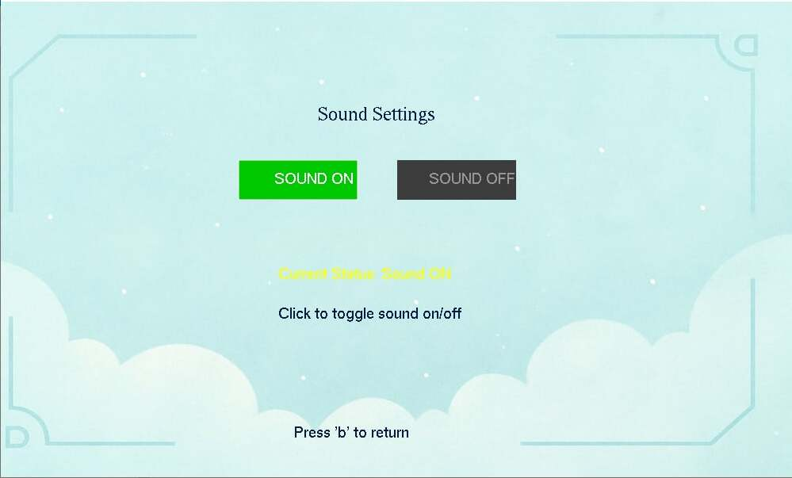
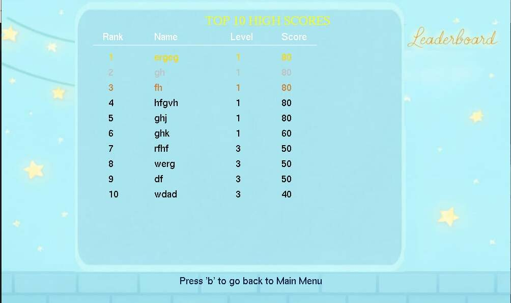
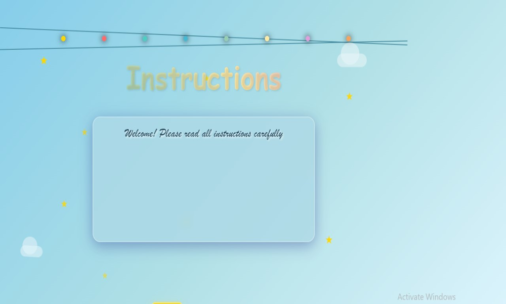
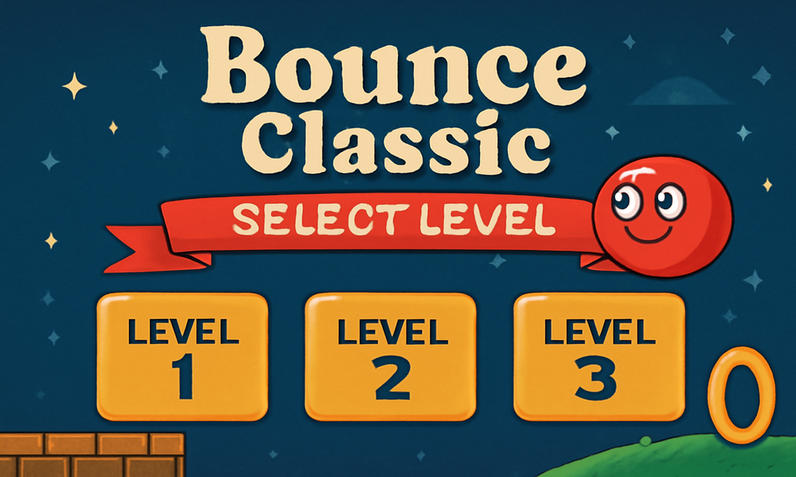
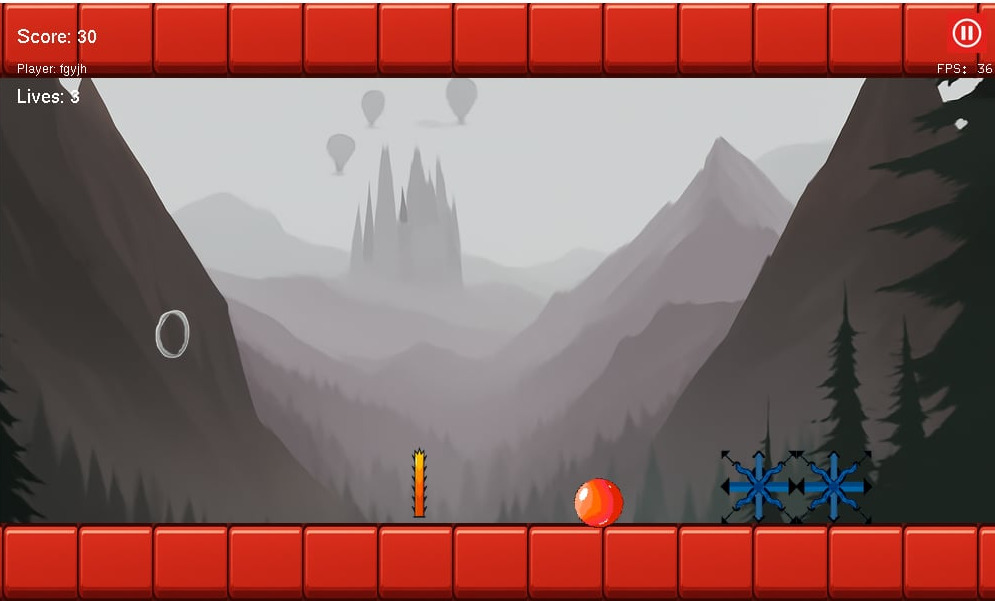
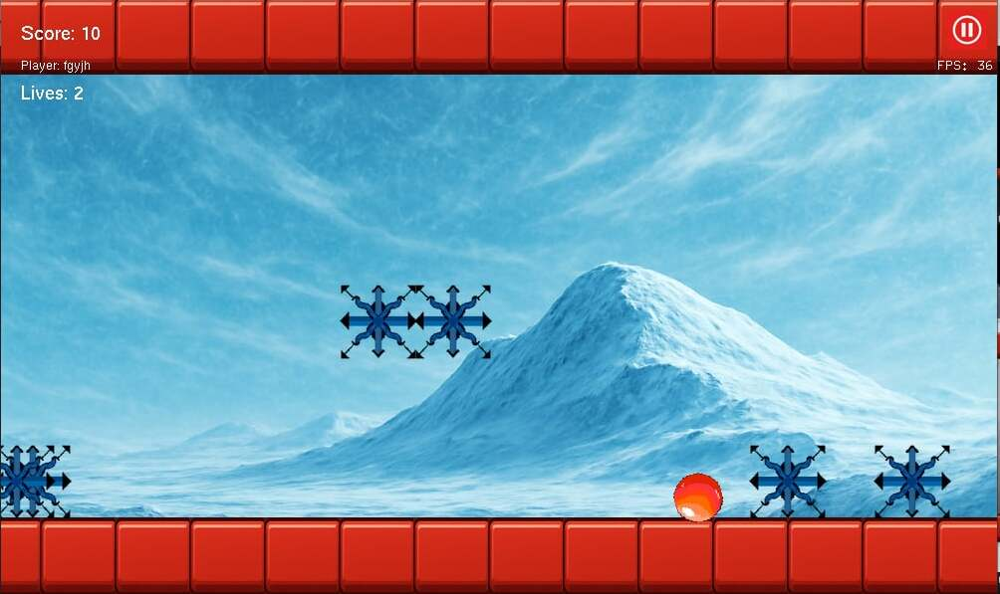
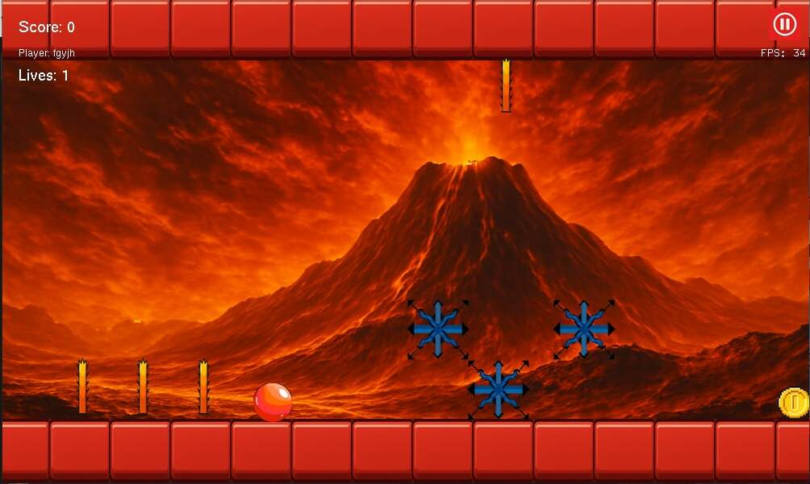
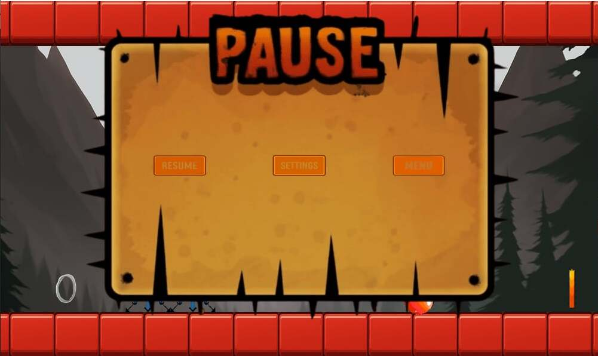
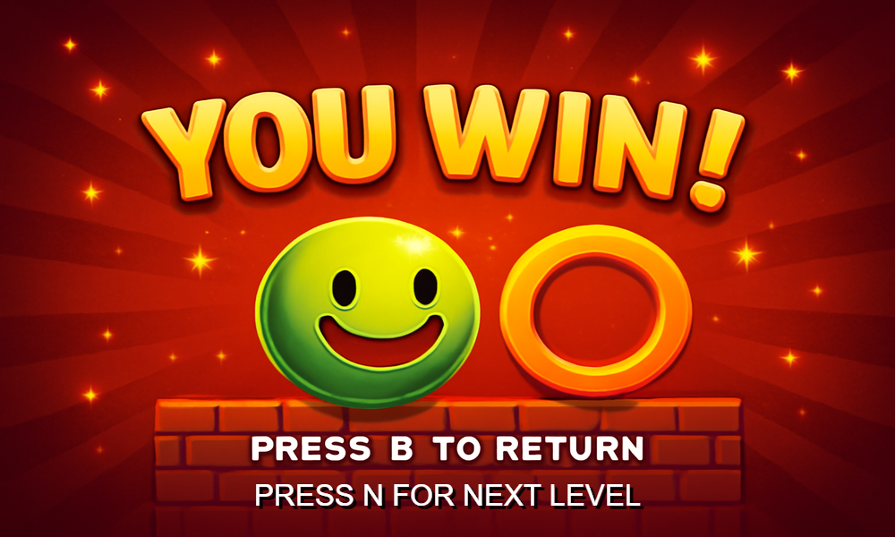

# Bounce Classic Game

## Introduction
This is a classic "Bounce" game developed using the iGraphics library. The game was built as part of level-1 term-1 lab project by students of the Computer Science and Engineering (CSE) department at Bangladesh University of Engineering and Technology (BUET). The development was supervised by Mahir Labib Dihan, Adjunct Lecturer at BUET.

### Team Members
- **Salman Faresi**  
- **Mahibur Rahman Fahim**  

### Supervisor  
- **Mahir Labib Dihan** (Adjunct Lecturer, BUET)

## Features
- A simple yet addictive game.
- The player controls a ball that bounces around the screen.
- The goal is to avoid obstacles and keep the ball in motion.
- Increasing difficulty levels as the game progresses.
- Smooth gameplay with intuitive controls.

## Technologies Used
- **C++**
- **iGraphics library** for graphical rendering and game development.

## How to Run the Game
 Ensure you have the following installed:
   - **C/C++ Compiler** (e.g., GCC)
   - **iGraphics library**: [Modern iGraphics README](https://github.com/mahirlabibdihan/Modern-iGraphics/blob/8e4758f379ab15dfee0e536fb4503c6e121afe8c/README.md)
   ## Watch it on YouTube
   - You can find the demo [here](https://youtu.be/IH5sCFg7bIg?si=gfGyfNAVIp9DhmeE)

## Main Menu

## About Us

## Settings

## Leaderboard

## Instructions

## Selecting Level

## Level 1

## Level 2

## Level 3

## Pause

## Victory

##Game Over

